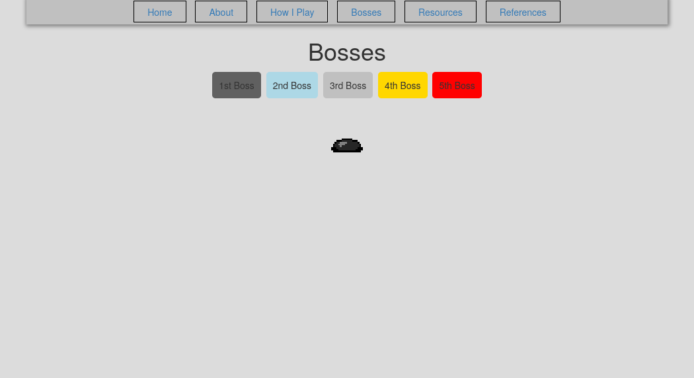

# Shattered Pixel Dungeon Fansite

This website was part of my final project for my IT 331 class (Web I: Web Development). It's dedicated to my appreciation of [Shattered Pixel Dungeon](https://github.com/00-Evan/shattered-pixel-dungeon), an open-source roguelike I've enjoyed playing on my phone. 

The website has six pages total and one data file:

- index.html: Landing page gives a brief description of the game with a graphic 
- about.html: About page gives a general description of the game itself 
- play.html: Play page describes how I like to play the game
- bosses.html: Bosses page previews different boss characters in game 
- resources.html: Resources page lists resources that help players in understanding the game  
- references.html: References page provides links for the references used
- classes.xml: Stores information related to character classes and subclasses player can choose 

As part of the requirements of the project, several features have been implemented for the purpose of gaining a deeper understand JavaScript and related technologies, including the following:
 
- Bootstrap (all pages)
    - default `.container` class
    - makes page responsive by changing `max-width` at each breakpoint
- Spry Data (About page)
    - `spry:repeat` elements within a `spry:region`
    - loops over data in XML file and formats ouput to table data cells
- jQuery (About, Resource pages)
    - validates form inputs via the Validation Plugin's `validate()` function
    - shakes image via UI library's `effect("shake")` function
    - decreases opacity of image when clicked after 1500 milliseconds via `animate()`
- XMLHttpRequest (Bosses page)
    - `mouseover` triggers request
    - async reponse returns file path of boss image, populating the image src attribute 
    - `mouseover` clears the path and thus the image
- localStorage (Landing page)
    - prompts user for their name and stores in the input via `localStorage.setItem()`
- geolocation (Reference page) 
    - `navigator.geolocation.getCurrentPosition()` prompts the user to share their location

**Attribution**

On the References page, I cite the sources of images I've used within the site. This includes assets from the game which can be found in the game's repository (linked above) and on the game's [website](https://shatteredpixel.com/). 